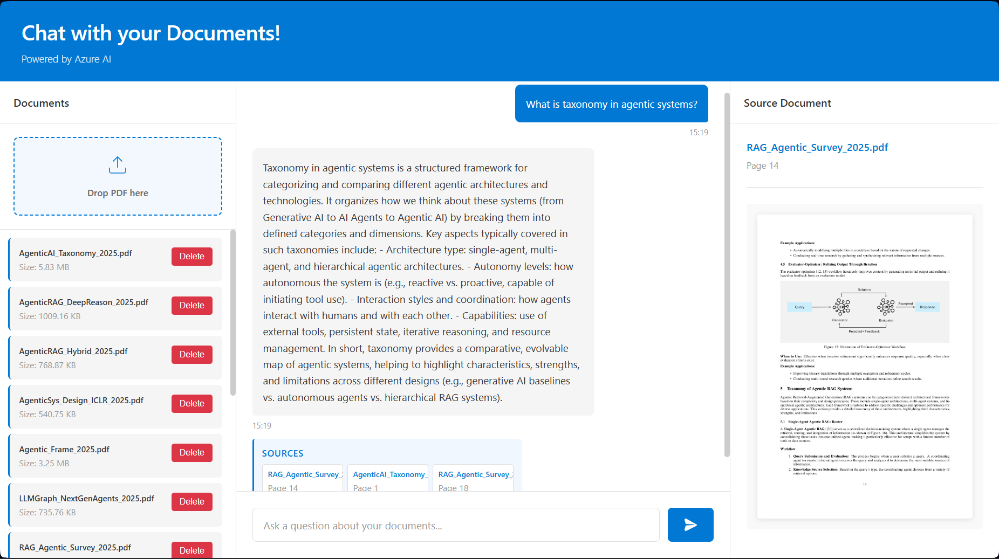

# Chat with Your Documents

A RAG (Retrieval-Augmented Generation) chatbot built on Azure cloud services. Upload PDF documents and ask questions using an intelligent AI assistant powered by Azure OpenAI and vector search.

## Features

- **Document Upload**: Drag-and-drop PDF uploads with automatic processing
- **Intelligent Search**: Vector similarity search combined with keyword matching
- **Streaming Responses**: Real-time response generation with source citations
- **PDF Viewer**: Click any source to view the referenced PDF page in fullscreen
- **Azure Integration**: Fully integrated with Azure cloud services

## Architecture

| Layer | Services |
| --- | --- |
| **Storage** | Azure Blob Storage |
| **Ingestion** | Azure Document Intelligence |
| **Intelligence - Embeddings** | Azure OpenAI (Text Embeddings) |
| **Intelligence - LLM** | Azure OpenAI (GPT) |
| **Search & Orchestration** | Azure Cognitive Search |

## How It Works

1. **Upload**: User uploads a PDF document via the web interface
2. **Extract**: Azure Document Intelligence extracts text and structure
3. **Chunk**: Text is split into semantic chunks using markdown headers
4. **Embed**: Each chunk is embedded using Azure OpenAI embeddings
5. **Index**: Embeddings and metadata are stored in Cognitive Search
6. **Query**: User question is embedded and vector-searched
7. **Generate**: Retrieved chunks are sent to Azure OpenAI GPT for response
8. **Stream**: Response streams character-by-character with source citations

## Technologies

- **Frontend**: HTML5, CSS3, Vanilla JavaScript
- **Backend**: Flask, Python 3.10+
- **AI/ML**: Azure OpenAI, LangChain
- **Search**: Azure Cognitive Search
- **Storage**: Azure Blob Storage
- **PDF Processing**: PyMuPDF, Azure Document Intelligence

## License

MIT
